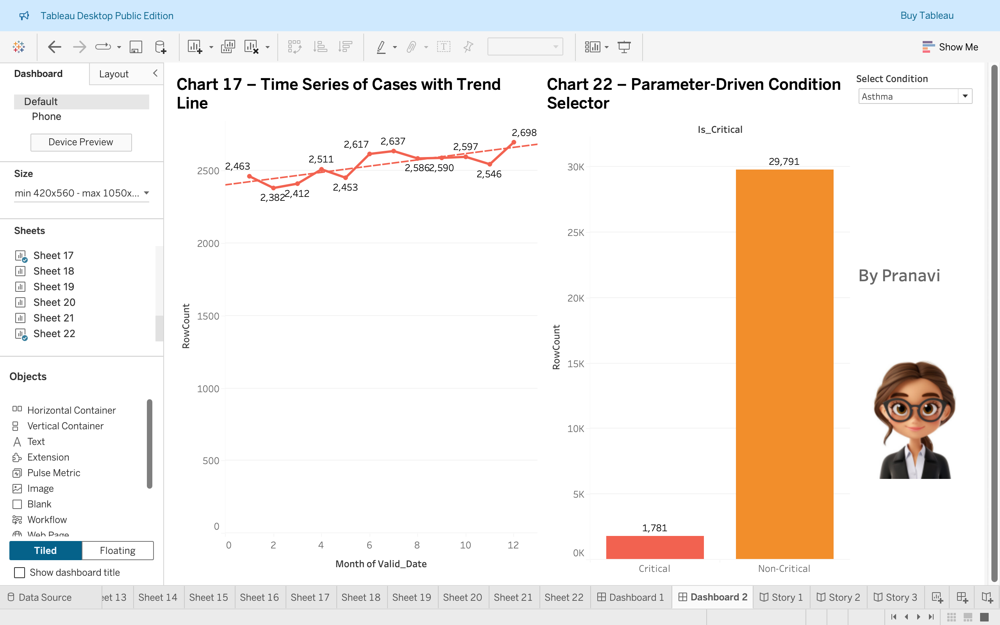

# COVID-19 Patient Precondition Analysis Tableau Project

📊 An interactive Tableau dashboard analyzing the impact of pre-existing conditions on COVID-19 patient outcomes.

---

## Data Source
### Kaggle COVID-19 Dataset
Link to the dataset is:
(https://www.kaggle.com/datasets/meirnizri/covid19-dataset/data)

---

## Project Files

- **Screenshots:** All dashboard and chart screenshots are located in the [`outputs`](./outputs) folder.  
- **Tableau Workbooks:** The Tableau workbook files (`.twb` and/or `.twbx`) used to create the charts, dashboards and story points are stored in the [`files`](./files) folder.

---

## Tableau Dashboard Overview

This project contains 25 charts and KPIs that provide insights into COVID-19 patient criticality based on age, preconditions, and other factors. Below is a summary of each visualization and its purpose:

| Chart # | Chart Type / Name                         | Purpose                                                          |
|---------|-------------------------------------------|------------------------------------------------------------------|
| 1       | Bar Chart – Critical Cases by Condition        | Identify which conditions most commonly lead to critical cases  |
| 2       | Pie/Donut Chart – Overall Outcome Breakdown    | Understand the overall proportion of critical vs non-critical patients |
| 3       | Scatter Plot - Age vs Cruciality (in aggregate)| Compare total age vs total patients per outcome                  |
| 4       | Box Plot - Age vs Criticality                   | View distribution of age across outcome types (criticality)     |
| 5       | Stacked Bar – Critical Cases by Age Group and Precondition | Analyze how different age groups are affected by specific preconditions |
| 6       | Heatmap – Precondition vs Criticality Rate     | Compare severity across preconditions at a glance                |
| 7       | Line Chart – Critical Cases Over Time           | Observe trends in critical cases over time, segmented by gender or age group |
| 8       | Stacked Bar – Age Group vs Criticality          | Show distribution of critical vs non-critical cases by age group |
| 9       | Dual-Axis Bar-Line – Age Distribution vs Criticality % | Compare population size and criticality rate across age groups   |
| 10      | Heatmap – Age Group & Sex vs % Critical          | Visualize criticality rates segmented by both age group and sex  |
| 11      | Highlight Table – Precondition vs Age Group Risk | Highlight risk levels of preconditions across different age groups |
| 12      | Dual-Axis Bar-Line – Age Group Counts vs Risk % | Display counts and risk percentages together by age group        |
| 13      | Tree Map – Proportion of Critical Cases by Condition | Show prevalence and severity of critical cases across conditions |
| 14      | Side-by-Side Bar Chart – Condition Prevalence (Critical vs Non-Critical) | Compare how common each precondition is between critical and non-critical patients |
| 15      | Stacked % Bar Chart – Risk Composition by Condition | Show proportion of critical vs non-critical cases per condition in percentage form |
| 16      | Dual-Axis Line Chart – Critical % Trend by Age  | See how % critical changes across ages, highlighting high-risk age bands |
| 17      | Time Series of Cases with Trend Line            | Show how total cases change over time, with a trend line for forecasting |
| 18      | KPI – Total Patients                             | Total count of patients in dataset                                |
| 19      | KPI – % Critical Cases                           | Percentage of patients who are critical                           |
| 20      | KPI – Average Age of Critical Patients           | Shows average age of all critical patients                        |
| 21      | KPI – Most Common Condition in Critical Cases   | Displays the most frequent comorbidity among critical cases      |
| 22      | Parameter-Driven Condition Selector              | Allows user to pick a condition from dropdown to compare critical vs non-critical |
| 23      | LOD-Based Metric – % Critical Overall            | Show percentage of critical cases that stays constant regardless of dashboard filters |
| 24a     | Mini Chart – Age Distribution                    | Small bar chart embedded in a tooltip to give extra context      |
| 24b     | Main Chart with Tooltip Visualization            | Main visual that displays the mini chart from 24a in its tooltip |

---

## Tableau Project Structure

### Dashboards

- **Dashboard 1: KPIs**  
  Displays key performance indicators summarizing the patient data:  
  - Total Patients  
  - % Critical Cases  
  - Average Age of Critical Patients  
  - Most Common Condition in Critical Cases

- **Dashboard 2: Trends & Condition Selector**  
  Focuses on trends and user-driven exploration:  
  - Trend line chart showing cases over time  
  - Parameter-driven Condition Selector allowing dynamic comparison of critical vs non-critical cases by condition

### Story Points

1. **COVID-19 at a Glance**  
   *Caption:* High-level KPIs show the scale and severity of cases.  
   *Content:* Dashboard 1 (KPIs)

2. **Trend of Critical Cases Over Time**  
   *Caption:* Critical case percentages have fluctuated but show notable peaks.  
   *Content:* Chart 17 (Time Series of Cases with Trend Line)

3. **Condition-Specific Criticality**  
   *Caption:* Different conditions contribute differently to critical case rates.  
   *Content:* Chart 22 (Parameter-Driven Condition Selector)

---

---

## 👩‍💻 Author
### Pranavi Kolipaka
Feel free to connect: [LinkedIn] (https://www.linkedin.com/in/vns-sai-pranavi-kolipaka-489601208/) | [GitHub] (https://github.com/Pranavi2002)
